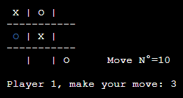

  <h1>Infinity Tic-Tac-Toe</h1>

## ITA
Una variante del classico gioco del Tris dove viene cancellato il segno più vecchio dopo alcuni turni (5 di default).

## ENG
A variant of the classic Tic-Tac-Toe where the oldest mark is deleted after a few turns (5 by default).

## Author & Developers
 - [Enrico Mancuso] :computer:

## Screenshot :camera:

	
	 

## How it works?
Compile and go! Play it on your terminal!

[Enrico Mancuso]: https://github.com/HidroSaphire
